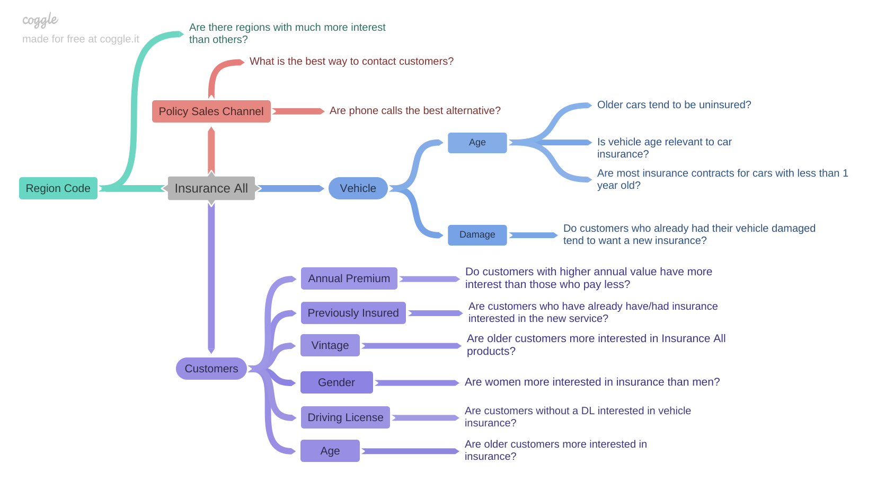
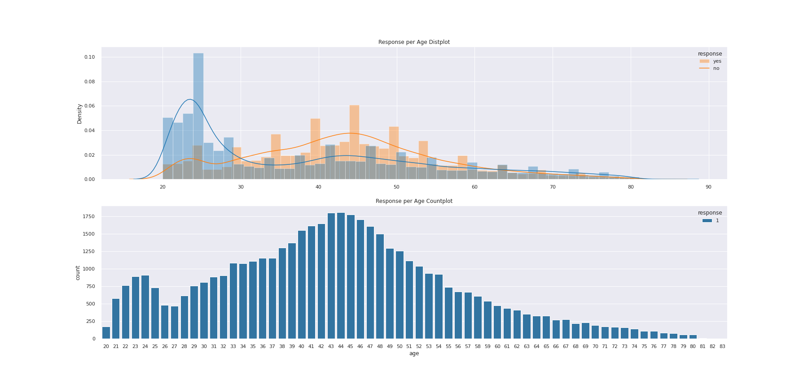
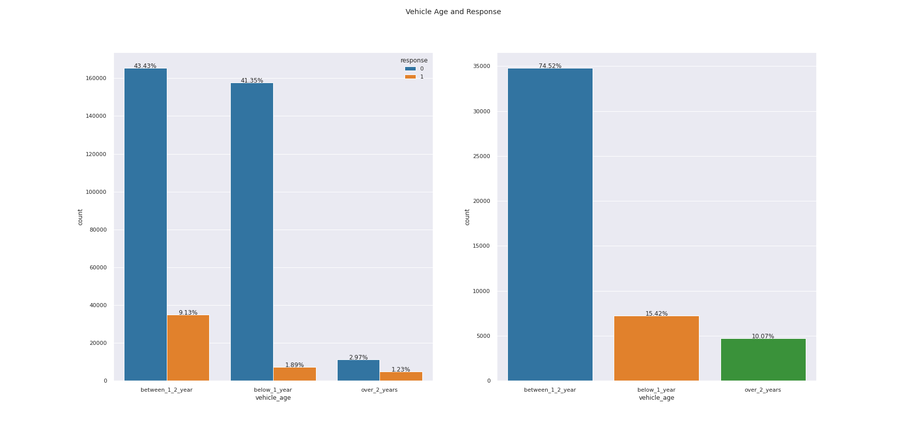
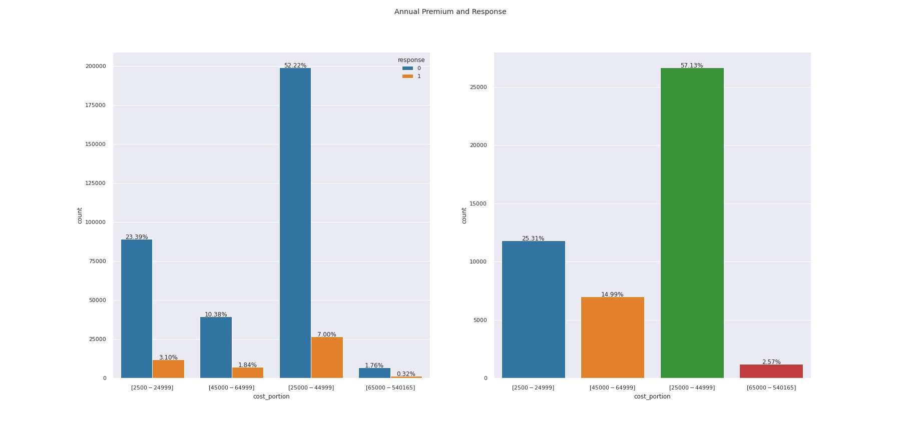

# <b>Insurance Cross Sell</b>

    

## Summary
- [1. Business Problem](#1-business-problem)
- [2. Dataset](#2-dataset)
- [3. Solution Strategy](#3-solution-strategy)
- [4. Mind Map Hypothesis](#4-mind-map-hypothesis)
- [5. Top 3 Data Insights](#5-top-3-data-insights)
- 

## 1. Business Problem

> Disclaimer: This is a fictional bussiness case, the company, context, CEO and bussiness questions exist only in my imagination.

The Insurance All is a company that provides health insurance to your customers for a long time, however, the sales team is interested in offering a new service, a car insurance.

Similar to the health insurance, customers of this vehicle insurance plan need to pay annually to Insurance All in order to be insured for an eventual incident.

Last year, the marketing team conducted a survey with 380,000 people asking about some interest in joining into a new car insurance. The responses from clients who showed interest or not in purchasing an auto insurance were saved in a database with others attributes.

The product team selected 127,000 new customers who did not respond to the survey to participate in a campaign, in which they will receive an offer of the new car insurance product. The offer will be made by the sales team through phone calls. 

However, the sales team has the capacity to make 20 thousand calls within the campaign period.

### 1.1 The Challenge

As a Data Scientist, your goal is to build a model that classifies a list of customers, informing the customer's possibility of contracting or not a car insurance. With the solution, the sales team hopes to be able to prioritize people with the greatest interest in the new product and thus optimize the campaign by only making contact with the customers most likely to make a purchase. In addition to the model, a report will be delivered containing the following information:

1.  Insights with the most relevant attributes of customers interested in purchasing auto insurance.
2.  What percentage of interested customers the sales team will be able to contact making 20,000 calls?
3.  By increasing the capacity to 40,000 calls, what percentage of interested customers the sales team will be able to contact?
4.  How many calls does sales team need to make to reach 80% of the most likely customers to purchase the car insurance?

## 2. Dataset

This dataset is avaliable [here](https://www.kaggle.com/anmolkumar/health-insurance-cross-sell-prediction). However, this project was maded in a dataset avaliable on the AWS platform and each row represent a customer and each column contain some attributes and the survey response.

**Data fields**

- **id**: Unique ID for the customer
- **gender**: Gender of the customer
- **age**: Age of the customer
- **driving_license**: 0 : Customer does not have DL, 1 : Customer already has DL
- **region_code**: Unique code for the region of the customer
- **previously_insured**: 1 : Customer already has Vehicle Insurance, 0 : Customer doesn't have Vehicle Insurance
- **vehicle_age**: Age of the Vehicle
- **vehicle_damage**: 1 : Customer got his/her vehicle damaged in the past, 0 : Customer didn't get his/her vehicle damaged in the past
- **annual_premium**: The amount customer needs to pay as premium in the year
- **policy_sales_channel**: Anonymized Code for the channel of outreaching to the customer ie. Different Agents, Over Mail, Over Phone, In Person, etc
- **vintage**: Number of Days, Customer has been associated with the company
- **response**: 1 : Customer is interested, 0 : Customer is not interested

## 3. Solution Strategy

#### Input
- Predict wheter customer will be interested in the car insurance;
- Database with customers answers and info;
 
#### Output
- Customers interested in car insurance;
- Performance of the model;
- Percentage of the customers reached with calls;
- Report;

#### Tasks
- Which customer will be interested in the insurance?
- Which customers have a DL?
- What is the vehicle age range with more interested customer?

#### Performance of the model
- Cumulative Gain;
- Lift Curve;
- Precision at K;
- Recall at K;

#### Action Plan
- Phone Calls only with the customers with the highest probability to take out the insurance;

### 3.1 Steps

**Step 01. Data Description:**  Use descriptive statistics metrics to measure data distribution

**Step 02. Feature Engineering:** Create features to describe the fenomenous.

**Step 03. Exploratory Data Analysis:** Find insights to better describe the fenomenous and brake wrong concepts.

**Step 04. Data Preparation:**  Select the most important features and prepare the data to the step 6.

**Step 05. Machine Learning Modelling:** Machine Learning model selection and training.

**Step 06. Hyperparameter Fine Tunning:** Find the best values of each parameter of the model.

**Step 07. Business Translation:** Convert the machine learning performance into business result.

**Step 07. Deploy Model:** Create a form to ship the model results for other teams.

## 4. Mind Map Hypothesis

    

## 5. Top 3 Data Insights

**Insight 01:** Interested customers have between 35 and 55 years old

**Insight 02:** Customers with vehicles with age between 1-2 years have much more interest (75.52%) than people who have a vehicle for less than 1 year.

**Insight 03:** Customer that paid between $25000-$44999 represents 57.13% of the total interested customers.

