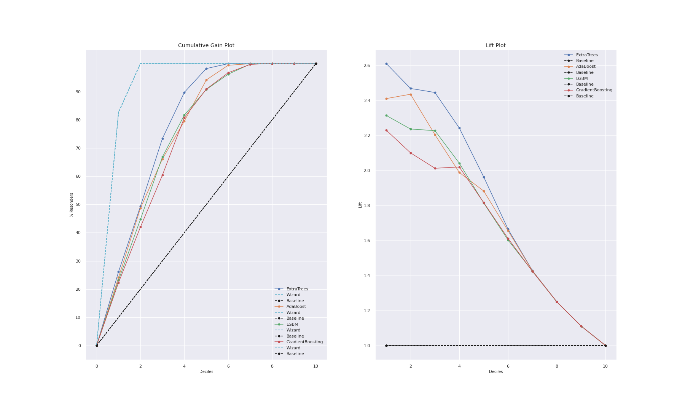
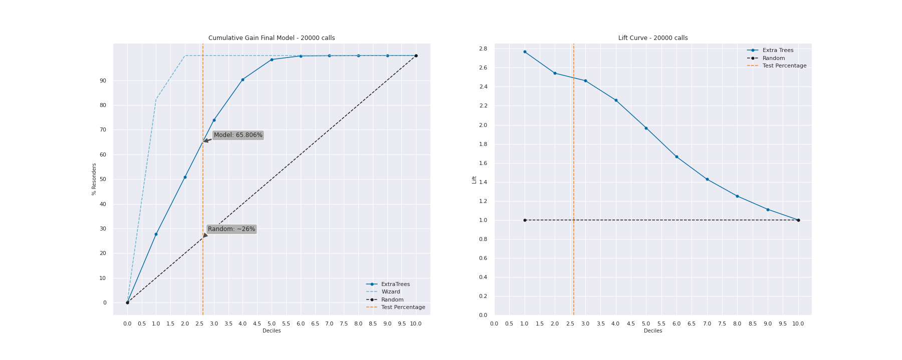
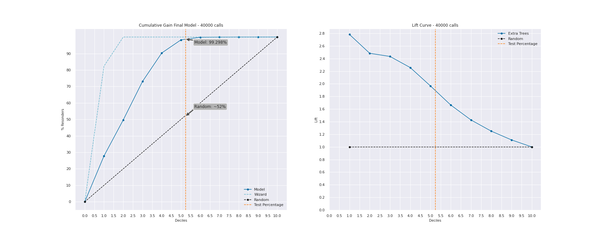
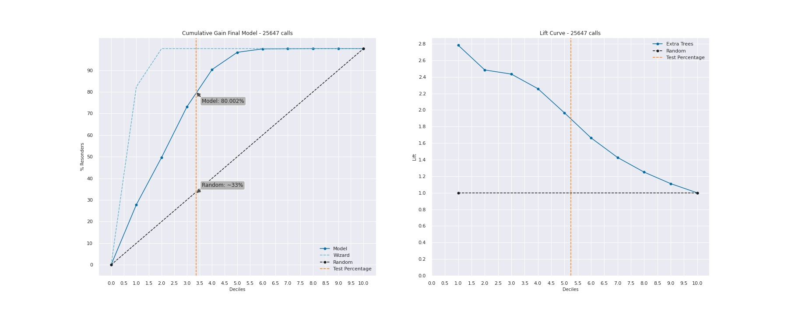
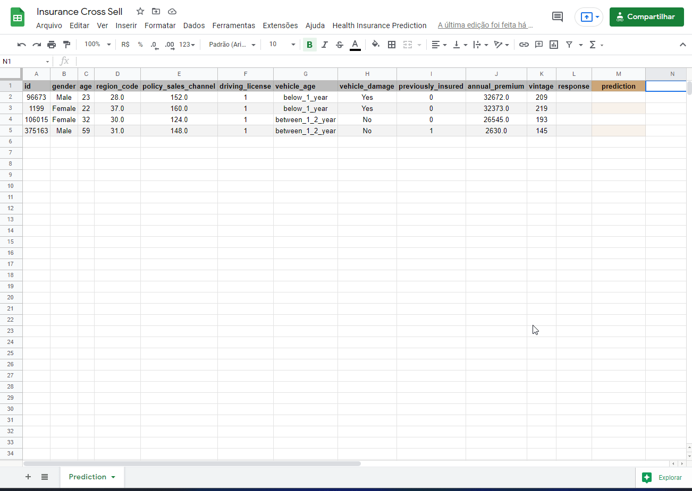

# <b>Insurance Cross Sell</b>

    

## Summary
- [1. Business Problem](#1-business-problem)
- [2. Dataset](#2-dataset)
- [3. Solution Strategy](#3-solution-strategy)
- [4. Mind Map Hypothesis](#4-mind-map-hypothesis)
- [5. Top 3 Data Insights](#5-top-3-data-insights)
- [6. Machine Learning Modelling](#6-machine-learning-modelling)
- [7. Machine Learning Performance](#7-machine-learning-performance)
- [8. Bussiness Performance](#8-bussiness-performance)
- [9. Deploy](#9-deploy)
- [10. Next Steps](#10-next-steps) 

## 1. Business Problem

> Disclaimer: This is a fictional bussiness case, the company, context, CEO and bussiness questions exist only in my imagination.

The Insurance All is a company that provides health insurance to your customers for a long time, however, the sales team is interested in offering a new service, a car insurance.

Similar to the health insurance, customers of this vehicle insurance plan need to pay annually to Insurance All in order to be insured for an eventual incident.

Last year, the marketing team conducted a survey with 380,000 people asking about some interest in joining into a new car insurance. The responses from clients who showed interest or not in purchasing an auto insurance were saved in a database with others attributes.

The product team selected 127,000 new customers who did not respond to the survey to participate in a campaign, in which they will receive an offer of the new car insurance product. The offer will be made by the sales team through phone calls. 

However, the sales team has the capacity to make 20 thousand calls within the campaign period.

### 1.1 The Challenge

As a Data Scientist, your goal is to build a model that classifies a list of customers, informing the customer's possibility of contracting or not a car insurance. With the solution, the sales team hopes to be able to prioritize people with the greatest interest in the new product and thus optimize the campaign by only making contact with the customers most likely to make a purchase. In addition to the model, a report will be delivered containing the following information:

1.  Insights with the most relevant attributes of customers interested in purchasing auto insurance.
2.  What percentage of interested customers the sales team will be able to contact making 20,000 calls?
3.  By increasing the capacity to 40,000 calls, what percentage of interested customers the sales team will be able to contact?
4.  How many calls does sales team need to make to reach 80% of the most likely customers to purchase the car insurance?

## 2. Dataset

This dataset is avaliable [here](https://www.kaggle.com/anmolkumar/health-insurance-cross-sell-prediction). However, this project was maded in a dataset avaliable on the AWS platform and each row represent a customer and each column contain some attributes and the survey response.

**Data fields**

- **id**: Unique ID for the customer
- **gender**: Gender of the customer
- **age**: Age of the customer
- **driving_license**: 0 : Customer does not have DL, 1 : Customer already has DL
- **region_code**: Unique code for the region of the customer
- **previously_insured**: 1 : Customer already has Vehicle Insurance, 0 : Customer doesn't have Vehicle Insurance
- **vehicle_age**: Age of the Vehicle
- **vehicle_damage**: 1 : Customer got his/her vehicle damaged in the past, 0 : Customer didn't get his/her vehicle damaged in the past
- **annual_premium**: The amount customer needs to pay as premium in the year
- **policy_sales_channel**: Anonymized Code for the channel of outreaching to the customer ie. Different Agents, Over Mail, Over Phone, In Person, etc
- **vintage**: Number of Days, Customer has been associated with the company
- **response**: 1 : Customer is interested, 0 : Customer is not interested

## 3. Solution Strategy

#### Input
- Predict wheter customer will be interested in the car insurance;
- Database with customers answers and info;
 
#### Output
- Customers interested in car insurance;
- Performance of the model;
- Percentage of the customers reached with calls;
- Report;

#### Tasks
- Which customer will be interested in the insurance?
- Which customers have a DL?
- What is the vehicle age range with more interested customer?

#### Performance of the model
- Cumulative Gain;
- Lift Curve;
- Precision at K;
- Recall at K;

#### Action Plan
- Phone Calls only with the customers with the highest probability to take out the insurance;

### 3.1 Steps

**Step 01. Data Description:**  Use descriptive statistics metrics to measure data distribution

**Step 02. Feature Engineering:** Create features to describe the fenomenous.

**Step 03. Exploratory Data Analysis:** Find insights to better describe the fenomenous and brake wrong concepts.

**Step 04. Data Preparation:**  Select the most important features and prepare the data to the step 6.

**Step 05. Machine Learning Modelling:** Machine Learning model selection and training.

**Step 06. Hyperparameter Fine Tunning:** Find the best values of each parameter of the model.

**Step 07. Business Translation:** Convert the machine learning performance into business result.

**Step 07. Deploy Model:** Create a form to ship the model results for other teams.

## 4. Mind Map Hypothesis

    

## 5. Top 3 Data Insights

**Insight 01:** Interested customers have between 35 and 55 years old

**Insight 02:** Customers with vehicles with age between 1-2 years have much more interest (75.52%) than people who have a vehicle for less than 1 year.

**Insight 03:** Customer that paid between $25000-$44999 represents 57.13% of the total interested customers.

## 6. Machine Learning Modelling

All machine learning algorithms were trained using cross validation on training data, the tested models were:
-   Logistic Regression
-   Random Forest Classifier
-   Extra Trees Classifier
-   Gaussian NB
-   XGB Classifier
-   CatBoost Classifier
-   AdaBoost Classifier
-   LGBMClassifier
-   KNeighbors Classifier
-   Gradient Boosting Classifier

### 6.1 Metrics

In this dataset, we have almost no relevant features for the prediction modelling, however, in this specific problem, the interest is not whether the person will buy a product or not, the main objective is to create a rank with a score for the customers most likely to accept an car insurance. The interest is to know the placement of customers on the probability list, a **rank to learn problem**.

With this particularity, metrics like precision, recall, f1-score don't represent the nature of the problem, We aren't interested in proving how good the model will be to making claims, the real goal is to know how good the model is for sorting a list, because of that, in rank to learn, sorting metrics are used, like precision at k, recall at k, cumulative gain and lift curve.

**Precision at K**: Of all the examples I predicted to be true, how many were actually true? This metric count how many predictions were correct up to k and divide by all predictions made by the model up to k.

**Recall at K**: Of all the examples that are actually true, how many have I predicted to be true? This metric count how many predictions were correct up to k and divide by all true examples.

**Cumulative gain**: X% of the customer base, ordered by probability of purchase contains Y% of everyone interested in the new product.

**Lift Curve**: How many times the ML model is batter than a baseline model for each % of base?

### 6.2 Cross Validation Results

| Model                        | Precision @K Mean | Recall @K Mean | ROCAUC |
| ---------------------------- | ----------------- | -------------- | ------ |
| Logistic Regression          | 0.79 ± 0.001      | 0.355 ± 0.001  | 0.807  |
| Random Forest Classifier     | 0.895 ± 0.105     | 0.402 ± 0.047  | 0.816  |
| Extra Trees Classifier       | 0.93 ± 0.099      | 0.417 ± 0.044  | 0.826  |
| Gaussian NB                  | 0.907 ± 0.094     | 0.407 ± 0.042  | 0.821  |
| XGB Classifier               | 0.926 ± 0.092     | 0.416 ± 0.041  | 0.791  |
| CatBoost Classifier          | 0.938 ± 0.088     | 0.421 ± 0.040  |  0.797 |
| AdaBoost Classifier          | 0.947 ± 0.084     | 0.425 ± 0.038  |  0.811 |
| LGBM Classifier              | 0.954 ± 0.081     | 0.428 ± 0.036  |  0.805 |
| KNeighbors Classifier        | 0.949 ± 0.077     | 0.426 ± 0.035  |  0.800 |
| Gradient Boosting Classifier | 0.954 ± 0.428     | 0.428 ± 0.034  |  0.807 |

GradientBoosting and LGBM showed excellent results in CV, while AdaBoost and ExtraTree had great results in Cumulative Gain and Lift Curve plots, I will compare these models in the next step to decide which one is the best.

## 7. Machine Learning Performance

The hyperparameter fine-tuned using Bayesian Optimization with Optuna was applied in LGBM, Gradient Boosting, Extra Trees and AdaBoost. All models showed similar results after parameter optimization, to select the best one, the use of **Lift and Cumulative Gain curves** were essential. As knowing the percentage of the base that we are going to reach is fundamental in rank to learn problems. These curves are a great support for data teams to evaluate the performance and very important for the administration and marketing teams know how many customers will reach with this help.

In the ranges of ~10% to ~60% of the baseline, Tunned ExtraTrees had the best results, because of this, it will be the chosen model.

## 8. Bussiness Performance

### 1. Insights with the most relevant attributes of customers interested in purchasing auto insurance.
**[Most Relevant Insights](#5-top-3-data-insights)**

**The most relevant attributes to define a customer interest are:**
- Age
- Region Code
- Policy Sales Channel
- Vehicle Damage
- Previously Insured
- Annual Premium
- Vintage

### 2.  What percentage of interested customers the sales team will be able to contact making 20,000 calls?
**64.618% of the interested customers.** With the proposed model, the result is aprox. 2.45 times better than a random choise.

If each insurance is $1000.00 this represents $19817720.00 revenue with random choice, $48782080.00 revenue with proposed model and the difference of return is **$28964360.00**

### 3. By increasing the capacity to 40,000 calls, what percentage of interested customers the sales team will be able to contact?
**99.298% of the interested customers.** With the proposed model, the result is aprox. 1.9 times better than a random choise.

If each insurance is $1000.00 this represents $39635440.00 revenue with random choice, $75459780.0 revenue with proposed model and the difference of return is **$35824340.00**

### 4. How many calls does sales team need to make to reach 80% of the most likely customers to purchase the car insurance?
**The Marketing team will call 80% of the interested customers if they make 25,647 phone calls.**

If each insurance is $1000.00 this represents $25153260.00 revenue with random choice, $60977600.00 revenue with proposed model and the difference of return is **$35824340.00**

## 9. Deploy

The API is hosted on Heroku and its avaliable on this URL: https://cross-sell-bot.herokuapp.com

### Method
Located in /predict, send a list of clients to get a probability of car insurance aquisition.

#### Input
-   Id
-   Gender
-   Age
-   Driving License
-   Region Code
-   Previously Insured
-   Vehicle Age
-   Vehicle Damage
-   Anual Premium
-   Policy sales channel
-   Vintage

#### Output
-   Id
-   Gender
-   Age
-   Driving License
-   Region Code
-   Previously Insured
-   Vehicle Age
-   Vehicle Damage
-   Anual Premium
-   Policy sales channel
-   Vintage
-   **Prediction Probability**

### How can I use it now?

Any employee of the Insurance All Company can use this [spreadsheet](https://docs.google.com/spreadsheets/d/1O3bM00Xxp7Jl_Q3GziYvIrwFrsei60J-YF9-SHt_7l4/edit?usp=sharing) and establish a ranking of customers most likely to purchase vehicle insurance, with direct production data.

## 10. Next Steps

For new CRISP-DS rounds, try change the deploy to a better architecture and explorate new form to deliver this product.

**:house_with_garden: Would you like to chat about it?**
* 
* 

